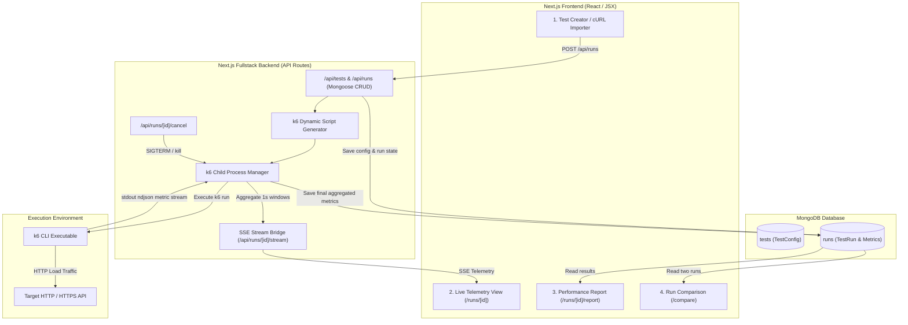

# LoadCheck — System Design Specification

**Date:** 2026-09-27  
**Status:** Approved  
**Version:** 1.0  
**Stack:** Next.js (App Router, Pure JavaScript / JSX), Tailwind CSS, Mongoose / MongoDB, k6 Engine (child_process), Lucide Icons, Recharts, Framer Motion

---

## 1. Executive Summary

**LoadCheck** is a developer-centric HTTP load testing platform built with a high-contrast Black & Yellow cyberpunk aesthetic. Instead of reinventing custom load generation engines, LoadCheck serves as an intelligent orchestration layer around Grafana **k6**. It enables developers to configure target endpoints (or paste `curl` commands), dynamically generate k6 test scripts, execute runs via Node child processes, stream real-time telemetry (RPS, active VUs, latency percentiles, status codes) over Server-Sent Events (SSE), persist results in MongoDB via Mongoose, and visualize performance reports and side-by-side run comparisons.

---

## 2. Architecture & System Flow



---

## 3. Database Schema (Mongoose)

### 3.1 `TestConfig` Schema (`models/TestConfig.js`)
Stores reusable test templates and endpoint specifications.

```javascript
const TestConfigSchema = new mongoose.Schema({
  name: { type: String, required: true, trim: true },
  description: { type: String, default: '' },
  targetUrl: { type: String, required: true, trim: true },
  httpMethod: { 
    type: String, 
    enum: ['GET', 'POST', 'PUT', 'PATCH', 'DELETE', 'HEAD', 'OPTIONS'], 
    default: 'GET' 
  },
  headers: [{
    key: { type: String, trim: true },
    value: { type: String, trim: true },
    enabled: { type: Boolean, default: true }
  }],
  auth: {
    authType: { type: String, enum: ['none', 'bearer', 'basic'], default: 'none' },
    token: { type: String, default: '' },
    username: { type: String, default: '' },
    password: { type: String, default: '' }
  },
  bodyType: { type: String, enum: ['none', 'json', 'raw'], default: 'none' },
  bodyContent: { type: String, default: '' },
  loadProfile: {
    type: { 
      type: String, 
      enum: ['constant_vus', 'ramping_vus', 'constant_rps'], 
      default: 'constant_vus' 
    },
    vus: { type: Number, default: 50, min: 1, max: 1000 },
    duration: { type: String, default: '30s' },
    stages: [{
      duration: { type: String, required: true },
      target: { type: Number, required: true }
    }],
    targetRps: { type: Number, default: 100 }
  },
  thresholds: [{
    metric: { type: String, default: 'http_req_duration' },
    operator: { type: String, enum: ['p95<', 'p99<', 'avg<', 'max<', 'rate<'], default: 'p95<' },
    value: { type: Number, default: 500 }
  }]
}, { timestamps: true });
```

### 3.2 `TestRun` Schema (`models/TestRun.js`)
Tracks an execution instance of a test and stores both time-series checkpoints and final summarized benchmarks.

```javascript
const TestRunSchema = new mongoose.Schema({
  testConfigId: { type: mongoose.Schema.Types.ObjectId, ref: 'TestConfig', required: false },
  snapshotConfig: { type: Object, required: true },
  status: { 
    type: String, 
    enum: ['pending', 'running', 'completed', 'failed', 'cancelled'], 
    default: 'pending' 
  },
  startedAt: { type: Date },
  finishedAt: { type: Date },
  durationSeconds: { type: Number, default: 0 },
  exitCode: { type: Number },
  errorMessage: { type: String },

  // Final Summary Benchmark
  metricsSummary: {
    totalRequests: { type: Number, default: 0 },
    successfulRequests: { type: Number, default: 0 },
    failedRequests: { type: Number, default: 0 },
    errorRate: { type: Number, default: 0 },
    peakRps: { type: Number, default: 0 },
    avgRps: { type: Number, default: 0 },
    latency: {
      avg: { type: Number, default: 0 },
      min: { type: Number, default: 0 },
      med: { type: Number, default: 0 },
      max: { type: Number, default: 0 },
      p90: { type: Number, default: 0 },
      p95: { type: Number, default: 0 },
      p99: { type: Number, default: 0 }
    },
    dataTransferred: {
      receivedBytes: { type: Number, default: 0 },
      sentBytes: { type: Number, default: 0 }
    },
    statusCodes: { type: Map, of: Number, default: {} },
    checksPassed: { type: Number, default: 0 },
    checksFailed: { type: Number, default: 0 }
  },

  // 1-second interval time-series for playback / charting
  timeSeriesMetrics: [{
    second: Number,
    timestamp: Date,
    currentRps: Number,
    activeVus: Number,
    p95Latency: Number,
    avgLatency: Number,
    errorCount: Number,
    status2xx: Number,
    status4xx: Number,
    status5xx: Number
  }],

  rawSummaryJson: { type: String }
}, { timestamps: true });
```

---

## 4. Execution Engine & k6 Pipeline

### 4.1 Script Generator (`lib/k6/generator.js`)
Converts `TestConfig` into a standard ES6 script executable by k6:
- Converts load profiles into `options.vus` + `options.duration` or `options.stages` or `options.scenarios` (for constant-arrival-rate / RPS targeting).
- Constructs HTTP headers, authentication (Bearer headers or Basic auth headers), and request bodies.
- Inserts k6 `check()` and custom metric tags (`k6/metrics`).
- Injects a standard summary output handler `handleSummary(data)` that emits clean structured JSON.

### 4.2 Runner & Real-Time Parser (`lib/k6/runner.js`)
- Uses Node.js `child_process.spawn('k6', ['run', '--out', 'json=-', tempScriptPath])` or summary JSON output pipes.
- Parses NDJSON streaming metric points (`http_reqs`, `http_req_duration`, `vus`, `checks`).
- Aggregates metrics on a 1-second rolling window.
- Emits real-time packets through an in-memory event bus (`lib/k6/eventBus.js`).
- Manages active running processes with a process registry to support instant cancellation (`SIGTERM` / `SIGKILL`).
- Upon completion, parses final summary stats, updates MongoDB `TestRun` document to `completed`, and notifies SSE listeners with a final `"done"` event.

### 4.3 Server-Sent Events (SSE) Route (`app/api/runs/[id]/stream/route.js`)
- Establishes a standard SSE stream `text/event-stream`.
- Listens to the `eventBus` for events matching `runId`.
- Yields live tick frames:
  ```json
  {
    "event": "tick",
    "data": {
      "runId": "6512...",
      "second": 14,
      "progress": 46.6,
      "activeVus": 100,
      "currentRps": 384,
      "p95": 142.5,
      "avg": 98.2,
      "errorRate": 0.5,
      "statusCodes": { "200": 382, "500": 2 }
    }
  }
  ```

---

## 5. User Interface & Theming Spec

### 5.1 Aesthetics & Design System
- **Theme:** Jet Black (`#050505` background, `#0E0E10` cards) + Electric Amber/Yellow accents (`#FACC15` primary, `#EAB308` hover, `#FEF08A` soft glow).
- **Typography:** Sans (`Geist`, `Inter`) for structural UI; Monospace (`JetBrains Mono`, `Geist Mono`) for telemetry values, JSON payloads, URLs, and status codes.
- **Accents:**
  - Status 2xx: Neon Emerald `#10B981`
  - Status 4xx: Warning Amber `#F59E0B`
  - Status 5xx / Failures: Neon Ruby `#EF4444`
  - Borders: `#1E1E24` default with `hover:border-yellow-400/40`
  - Glowing effects: subtle `shadow-[0_0_20px_rgba(250,204,21,0.15)]` on key stats and buttons.

### 5.2 Core Views (JSX)
1. **Header & Navigation (`components/Navbar.jsx`)**:
   - Brand logo with electric lightning icon `LoadCheck ⚡`.
   - Navigation links: **New Test**, **Dashboard / Runs**, **Compare Runs**, **Docs**.
   - Database connection status indicator (MongoDB connected pill).

2. **Dashboard & Test Creator (`app/page.jsx` & `app/tests/new/page.jsx`)**:
   - **Quick Run Bar**: URL input with method dropdown (GET/POST/...), Run Test button.
   - **cURL Quick Import Modal / Input**: Paste a `curl` string to auto-populate URL, Method, Headers, and Body.
   - **Configuration Tabs**:
     - *Load Profile*: Constant VUs, Ramping Stages builder, RPS Target.
     - *Headers & Auth*: Key-value table + Bearer Token / Basic Auth helper.
     - *Request Body*: JSON syntax-highlighted editor with validation.
     - *Thresholds / SLOs*: e.g. Fail if p95 > 500ms or error rate > 1%.
   - **Recent Runs Table**: Quick overview of recent benchmark results with 1-click re-test.

3. **Live Execution Screen (`app/runs/[id]/page.jsx`)**:
   - Live state badge (`RUNNING` with pulse animation).
   - Speedometer / live RPS counter.
   - Live Latency Sparkline (p50 vs p95 vs p99).
   - Real-time HTTP response status distribution bar.
   - Progress bar with remaining time countdown.
   - **Emergency Stop** button (calls `/api/runs/[id]/cancel`).
   - Automatically transitions to the Performance Report upon test completion.

4. **Performance Report Screen (`app/runs/[id]/report/page.jsx`)**:
   - Hero Scorecard: Total Requests, Success Rate %, p95 Latency, Peak RPS, Data Transferred.
   - Response Time Percentile Breakdown (min, avg, med, p90, p95, p99, max).
   - Multi-series Charts: RPS over Time, Latency over Time, HTTP Status Code distribution.
   - System Capacity / Health Assessment summary card.
   - Action buttons: Re-run test, Compare with another run, Export JSON, Copy shareable link.

5. **Run Comparison Screen (`app/compare/page.jsx`)**:
   - Select Run A (Baseline) and Run B (Comparison).
   - Side-by-side metric comparison table with $\Delta$ diff calculations (green for improvement, red for regression).
   - Dual-line overlaid performance charts.

---

## 6. Safety, Limits & Error Handling

1. **Safety Envelopes**:
   - Maximum Virtual Users: 1,000 VUs
   - Maximum Duration: 300 seconds (5 minutes)
   - Maximum Target RPS: 2,500 RPS
2. **Identification Header**:
   - Every outbound request automatically includes `User-Agent: LoadCheck-Engine/1.0 (+https://github.com/Nithin0620/loadTest)` and `X-LoadCheck-Run-Id: <runId>`.
3. **Graceful Process Handling**:
   - Active processes are tracked in an in-memory process registry with timeout watchdog.
   - Server restart / crash recovery: on startup, orphaned `running` status tests are marked as `failed` or `cancelled`.
   - k6 binary availability check: if `k6` is not found on `$PATH`, the backend returns a clear actionable error banner with installation commands.

---

## 7. Testing & Verification Plan

1. **Unit & Integration Tests**:
   - `generator.test.js`: Verify correct k6 script generation for all HTTP methods, auth types, headers, and load profiles.
   - `curlParser.test.js`: Verify accurate parsing of complex cURL strings into structured config.
   - `api.test.js`: Test API route handlers for test creation, run trigger, cancellation, and metrics retrieval.
2. **End-to-End Verification**:
   - Spin up a local dummy HTTP echo/delay server (`/api/mock-target`).
   - Run a 5-second constant VU load test and verify:
     1. Database records created in MongoDB.
     2. SSE stream connects and emits ticking metrics.
     3. k6 completes with exit code 0.
     4. Summary report reflects accurate request counts and latency percentiles.
     5. Comparison screen accurately compares two distinct runs.
